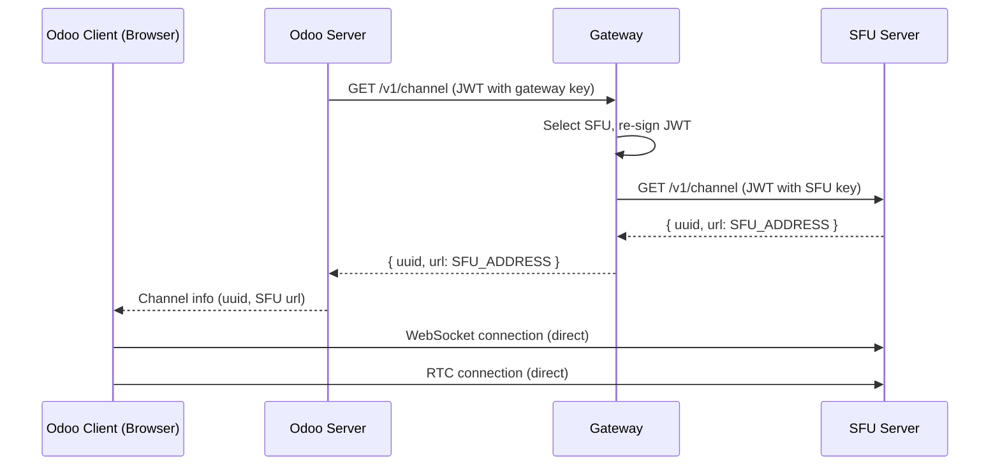

# Implementation Guide

## Overview

The SFU Gateway acts as a transparent load balancer between Odoo and multiple SFU servers. Neither Odoo nor the SFUs need to know they're communicating through a gateway.

## Architecture




## Configuration

### On Odoo

Replace the SFU URL and key with the gateway's:

```python
# Before (direct SFU connection)
ODOO_SFU_URL = "http://sfu1.example.com:8070"
ODOO_SFU_KEY = "sfu1-secret-key"

# After (through gateway)
ODOO_SFU_URL = "http://gateway.example.com:8071"
ODOO_SFU_KEY = "gateway-secret-key"
```

That's it. Odoo doesn't need to know it's talking to a gateway.

### On Each SFU

No changes required. Each SFU keeps its existing `AUTH_KEY` configuration.

### On the Gateway

1. Set environment variables:
   ```bash
   export SFU_GATEWAY_KEY="gateway-secret-key"  # Same as ODOO_SFU_KEY
   export SFU_GATEWAY_PORT="8071"               # Optional, default 8071
   export SFU_GATEWAY_BIND="0.0.0.0"            # Optional, default 0.0.0.0
   ```

2. Create `secrets.toml` with your SFU entries:
   ```toml
   [[sfu]]
   address = "http://sfu1.example.com:8070"
   region = "eu-west"
   key = "sfu1-secret-key"  # Must match AUTH_KEY on sfu1

   [[sfu]]
   address = "http://sfu2.example.com:8070"
   region = "us-east"
   key = "sfu2-secret-key"  # Must match AUTH_KEY on sfu2
   ```

3. Protect the secrets file:
   ```bash
   chmod 600 secrets.toml
   ```

4. Run the gateway:
   ```bash
   ./sfu-gateway --secrets secrets.toml
   ```

## How It Works

1. **Odoo** sends a `/v1/channel` request to the gateway (JWT signed with gateway key)
2. **Gateway** verifies the JWT, selects an SFU based on region/load
3. **Gateway** re-signs the JWT with the selected SFU's key
4. **Gateway** forwards the request to the SFU
5. **SFU** responds with `{ uuid, url }` where `url` is the SFU's direct address
6. **Clients** connect via WebSocket directly to the SFU (bypassing gateway)

## Key Points

- **Transparent**: Odoo and SFUs don't need code changes
- **WebSocket bypass**: Only `/channel` goes through gateway; WebSocket traffic goes direct
- **Per-SFU keys**: Each SFU can have its own unique key
- **Region routing**: Optional `?region=eu-west` query param for geo-routing
