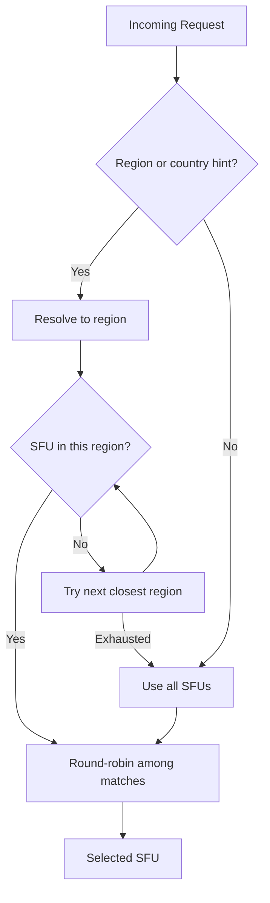

# Load Balancing

## Server Selection Strategy

The gateway selects an SFU using a multi-step process that considers geographic proximity.

### 1. Region Resolution

The gateway accepts two query parameters for geo-based routing:

- `?region=eu-west` — Explicit region hint (takes priority)
- `?country=FR` — ISO 3166-1 alpha-2 country code (mapped to region)

If both are provided, `region` takes precedence.

### 2. Proximity-Based Fallback

When the preferred region has no available SFUs, the gateway tries nearby regions in order of geographic distance (Haversine formula).

See `src/geo.rs` for the full list of regions and country mappings.



### 3. Round-Robin Selection

Among candidates in the selected region, the gateway uses round-robin to distribute load.

## Configuration

Each SFU can have an optional region:

```toml
[[sfu]]
address = "http://sfu-eu1.example.com:8070"
region = "eu-west"
key = "..."
```

## Usage from Odoo

```python
from odoo.http.geoip import GeoIP

geoip = GeoIP(client_ip)
response = requests.get(
    sfu_url + "/v1/channel",
    params={"country": geoip.country_code},
    headers={"Authorization": f"Bearer {jwt}"},
)
```

## Future Improvements

- Cache region lookups at boot time instead of per-request
- Load-based weighting via `/v1/stats`
- Skip unhealthy SFUs via health checks
