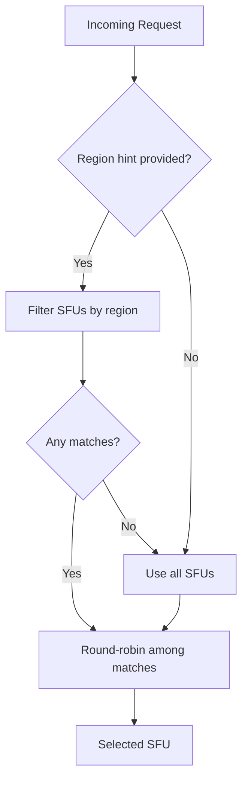

# Load Balancing

## Server Selection Strategy

The gateway selects an SFU using a two-step process:

### 1. Region Filtering

If the `?region=` query parameter is provided, the gateway filters to SFUs matching that region.

```
GET /v1/channel?region=eu-west
```

Only SFUs configured with `region = "eu-west"` (in `secrets.toml` or `SFU_GATEWAY_NODES`) will be considered.

If no SFUs match the requested region, the gateway falls back to all available SFUs.

### 2. Round-Robin Selection

Among the filtered candidates, the gateway uses round-robin to distribute load evenly.



## Configuration

Each SFU in the configuration (`secrets.toml` or `SFU_GATEWAY_NODES`) can have an optional region:

```toml
[[sfu]]
address = "http://sfu-eu1.example.com:8070"
region = "eu-west"
key = "..."

[[sfu]]
address = "http://sfu-eu2.example.com:8070"
region = "eu-west"
key = "..."

[[sfu]]
address = "http://sfu-us1.example.com:8070"
region = "us-east"
key = "..."
```

## Using Region Hints

Odoo can pass a region hint when requesting a channel:

```python
response = requests.get(
    sfu_url + "/v1/channel",
    params={"region": "eu-west"},  # Route to European SFU
    headers={"Authorization": f"Bearer {jwt}"},
)
```

## Future: Load-Based Selection

The current implementation uses simple round-robin. Future versions may:

- Query SFU `/v1/stats` for current load
- Weight selection based on active sessions/CPU/bandwidth
- Skip unhealthy SFUs detected via health checks
