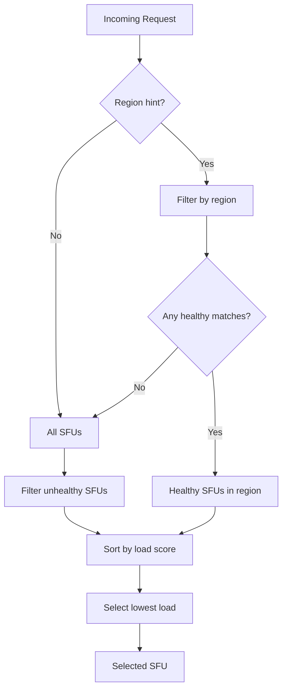

# Roadmap

## Proper handling of the SFU `/disconnect` route

The SFU `/disconnect` is not reached through the gateway (and shouldn't be). The issue is that the route payload is signed with a `key` that is the key of the SFU (which is now the key of the gateway). The odoo server no longer knows that key (and shouldn't).

The key check should be removed from the `/disconnect` route. Only the IP check would remain (this should already be correctly set as the gateway forwards with x-forwarded-for). Then additional security can be implemented at the infrastructure level (eg: mTLS).

That would allow the Odoo code to remain unchanged: it still signs the payload with a key, it's just wrong.
But we can ignore that and still peek into the JWT (see https://github.com/odoo/sfu/pull/21 ) for backwards compatibility.

## SFU Self-Registration or External Registry

Allow SFUs to register themselves with the gateway and periodically report their load.
Or use an external registry (like what Odoo probably already has). Just need create a
health route.

Odoo registry can provide a /sfu-list endpoint, with a Etag (must change etag intelligently to
still provide up to date load information).

### Implementation

1. **Optional Gateway Config on SFU**

   New environment variables on the SFU:
   - `SFU_GATEWAY_URL` — Gateway base URL (e.g., `http://gateway:8071`)
   - `SFU_GATEWAY_PING_INTERVAL` — Ping interval in ms (default: 10000)
   - `SFU_REGION` — Region identifier for load balancing

   When `SFU_GATEWAY_URL` is set, the SFU:
   - Sends a heartbeat on startup and periodically via `POST /v1/sfu`
   - Sends a sign-off on graceful shutdown

2. **Unified Heartbeat Payload (SFU → Gateway)**

   ```json
   {
     "status": "up",
     "address": "http://sfu1.example.com:8070",
     "region": "eu-west",
     "key": "<base64-encoded-auth-key>",
     "channels": 12,
     "sessions": 45,
     "cpuUsage": 0.35,
     "memoryUsage": 0.48
   }
   ```

   The `status` field determines the SFU state:
   - `"up"` — SFU is healthy and available (used for registration and periodic pings)
   - `"down"` — SFU is signing off (graceful shutdown)

3. **Gateway Endpoint**

   - `POST /v1/sfu` — Receives heartbeat, registers/updates SFU, or removes on sign-off, protected route


## Load-Based Selection

Replace round-robin with intelligent selection that routes to the least-loaded SFU.

### Selection Algorithm



### Load Score Calculation

Combine multiple factors into a weighted score:

```
load_score = (w1 × sessions/max_sessions) 
           + (w2 × cpu_usage) 
           + (w3 × memory_usage)
```

Default weights:
- `w1 = 0.5` (session count is primary factor)
- `w2 = 0.3` (CPU usage)  
- `w3 = 0.2` (memory usage)

(TODO: also give weight inverse to geogrphic distance)

### Configuration

```toml
[balancing]
strategy = "load"  # or "round-robin" for fallback

[balancing.weights]
sessions = 0.5
cpu = 0.3
memory = 0.2
```

---

## Graceful Degradation

Handle partial failures and overload scenarios gracefully.

### Features

1. **Automatic Failover with Retry**  
   If the selected SFU fails to create a channel (timeout, 5xx, connection error), the gateway retries with the next-best candidate — up to `max_retries` attempts.

   ```mermaid
   flowchart LR
       A[Request] --> B[Select SFU]
       B --> C{Forward to SFU}
       C -->|Success| D[Return channel]
       C -->|Failure| E{Retries left?}
       E -->|Yes| F[Mark SFU down, select next]
       F --> C
       E -->|No| G[Return 503]
   ```

   **Configuration**:
   ```toml
   [failover]
   max_retries = 3  # try up to 3 different SFUs
   retry_timeout_ms = 5000
   ```

2. **Circuit Breaker**  
   Stop routing to SFUs that are consistently failing, with automatic recovery attempts.

3. **Overload Protection**  
   Reject requests if all SFUs exceed load thresholds or all retries exhausted (HTTP 503).

4. **Health Dashboard** (optional)  
   Expose `/v1/health` endpoint showing status of all SFUs for monitoring.

