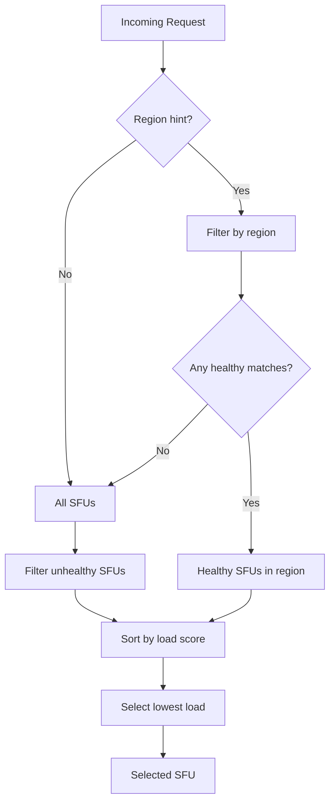

# Roadmap

## Phase 1: SFU Self-Registration

### Goal

Allow SFUs to register themselves with the gateway and periodically report their load. This push-based model is more scalable than polling and enables dynamic SFU discovery.

### Implementation

1. **Optional Gateway Config on SFU**

   New environment variables on the SFU:
   - `SFU_GATEWAY_URL` — Gateway base URL (e.g., `http://gateway:8071`)
   - `SFU_GATEWAY_PING_INTERVAL` — Ping interval in ms (default: 10000)
   - `SFU_REGION` — Region identifier for load balancing

   When `SFU_GATEWAY_URL` is set, the SFU:
   - Sends a heartbeat on startup and periodically via `POST /v1/sfu`
   - Sends a sign-off on graceful shutdown

2. **Unified Heartbeat Payload (SFU → Gateway)**

   ```json
   {
     "status": "up",
     "address": "http://sfu1.example.com:8070",
     "region": "eu-west",
     "key": "<base64-encoded-auth-key>",
     "channels": 12,
     "sessions": 45,
     "cpuUsage": 0.35,
     "memoryUsage": 0.48
   }
   ```

   The `status` field determines the SFU state:
   - `"up"` — SFU is healthy and available (used for registration and periodic pings)
   - `"down"` — SFU is signing off (graceful shutdown)

3. **Gateway Endpoint**

   - `POST /v1/sfu` — Receives heartbeat, registers/updates SFU, or removes on sign-off

4. **Health Tracking**

   The gateway marks an SFU as unhealthy if no heartbeat is received within `unhealthy_threshold` seconds (default: 30s).

### Outcome

The gateway dynamically discovers SFUs and maintains real-time knowledge of each SFU's status and load metrics without requiring static configuration.

---

## Phase 2: Load-Based Selection

### Goal

Replace round-robin with intelligent selection that routes to the least-loaded SFU.

### Selection Algorithm



### Load Score Calculation

Combine multiple factors into a weighted score:

```
load_score = (w1 × sessions/max_sessions) 
           + (w2 × cpu_usage) 
           + (w3 × memory_usage)
```

Default weights:
- `w1 = 0.5` (session count is primary factor)
- `w2 = 0.3` (CPU usage)  
- `w3 = 0.2` (memory usage)

### Configuration

```toml
[balancing]
strategy = "load"  # or "round-robin" for fallback

[balancing.weights]
sessions = 0.5
cpu = 0.3
memory = 0.2
```

---

## Phase 3: Graceful Degradation

### Goal

Handle partial failures and overload scenarios gracefully.

### Features

1. **Automatic Failover with Retry**  
   If the selected SFU fails to create a channel (timeout, 5xx, connection error), the gateway retries with the next-best candidate — up to `max_retries` attempts.

   ```mermaid
   flowchart LR
       A[Request] --> B[Select SFU]
       B --> C{Forward to SFU}
       C -->|Success| D[Return channel]
       C -->|Failure| E{Retries left?}
       E -->|Yes| F[Mark SFU down, select next]
       F --> C
       E -->|No| G[Return 503]
   ```

   **Configuration**:
   ```toml
   [failover]
   max_retries = 3  # try up to 3 different SFUs
   retry_timeout_ms = 5000
   ```

2. **Circuit Breaker**  
   Stop routing to SFUs that are consistently failing, with automatic recovery attempts.

3. **Overload Protection**  
   Reject requests if all SFUs exceed load thresholds or all retries exhausted (HTTP 503).

4. **Health Dashboard** (optional)  
   Expose `/v1/health` endpoint showing status of all SFUs for monitoring.
