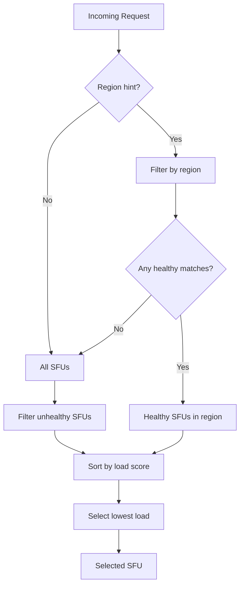

# Roadmap

## Phase 1: Health Checks

### Goal

Periodically poll SFUs to determine their availability and current load.

### Implementation

1. **New `/v1/load` Endpoint on SFU**  
   
   > [!NOTE]
   > The existing `/v1/stats` returns per-channel details (for debugging/monitoring).  
   > We add a new `/v1/load` route for lightweight aggregate metrics — no API version change needed.

   Response format:
   ```json
   {
     "channels": 12,
     "sessions": 45,
     "cpuUsage": 0.35,
     "memoryUsage": 0.48
   }
   ```
   
   This endpoint is unauthenticated (or uses a simple shared secret) for fast polling.

2. **Gateway Health Monitor**  
   The gateway spawns a background task that:
   - Polls each SFU's `/v1/stats` at a configurable interval (e.g., 10s)
   - Tracks response times and availability
   - Marks SFUs as unhealthy after consecutive failures

3. **Configuration**
   ```toml
   [health]
   interval_seconds = 10
   timeout_seconds = 5
   unhealthy_threshold = 3  # failures before marking unhealthy
   ```

### Outcome

The gateway maintains real-time knowledge of each SFU's status and load metrics.

---

## Phase 2: Load-Based Selection

### Goal

Replace round-robin with intelligent selection that routes to the least-loaded SFU.

### Selection Algorithm



### Load Score Calculation

Combine multiple factors into a weighted score:

```
load_score = (w1 × sessions/max_sessions) 
           + (w2 × cpu_usage) 
           + (w3 × memory_usage)
```

Default weights:
- `w1 = 0.5` (session count is primary factor)
- `w2 = 0.3` (CPU usage)  
- `w3 = 0.2` (memory usage)

### Configuration

```toml
[balancing]
strategy = "load"  # or "round-robin" for fallback

[balancing.weights]
sessions = 0.5
cpu = 0.3
memory = 0.2
```

---

## Phase 3: Graceful Degradation

### Goal

Handle partial failures and overload scenarios gracefully.

### Features

1. **Automatic Failover with Retry**  
   If the selected SFU fails to create a channel (timeout, 5xx, connection error), the gateway retries with the next-best candidate — up to `max_retries` attempts.

   ```mermaid
   flowchart LR
       A[Request] --> B[Select SFU]
       B --> C{Forward to SFU}
       C -->|Success| D[Return channel]
       C -->|Failure| E{Retries left?}
       E -->|Yes| F[Mark SFU down, select next]
       F --> C
       E -->|No| G[Return 503]
   ```

   **Configuration**:
   ```toml
   [failover]
   max_retries = 3  # try up to 3 different SFUs
   retry_timeout_ms = 5000
   ```

2. **Circuit Breaker**  
   Stop routing to SFUs that are consistently failing, with automatic recovery attempts.

3. **Overload Protection**  
   Reject requests if all SFUs exceed load thresholds or all retries exhausted (HTTP 503).

4. **Health Dashboard** (optional)  
   Expose `/v1/health` endpoint showing status of all SFUs for monitoring.

---

## Phase 4: Disconnect Refactoring

### Problem

The current `/v1/disconnect` endpoint verifies requests by matching the caller's IP address against the channel's `remoteAddress`. With the gateway architecture, all requests originate from the gateway's IP, breaking this validation.

### Solution

Switch from address-based to **channel-key-only** authentication:

1. **Channel Key Exchange**  
   During `/v1/channel`, Odoo passes a `key` claim in the JWT. This key is stored with the channel and is the **sole** proof of ownership.

2. **Odoo Signs with Channel Key**  
   For each channel with sessions to disconnect, Odoo signs a JWT using that channel's key.

3. **SFU Validation**  
   The SFU verifies the JWT signature using the channel's stored key. No `iss` or address matching — the valid signature alone proves ownership.

### New Request Format

`POST /v1/disconnect`

Body is a map of channel UUIDs to signed JWTs:

```json
{
  "31dcc5dc-4d26-453e-9bca-ab1f5d268303": "<JWT signed with channel1 key>",
  "a2b3c4d5-1234-5678-90ab-cdef12345678": "<JWT signed with channel2 key>"
}
```

Each JWT payload contains the sessions to disconnect:

```json
{
  "sessionIds": ["session1", "session2"],
  "exp": 1234567890
}
```

> [!IMPORTANT]
> This is a breaking change for the SFU's `/v1/disconnect` endpoint and requires coordination between SFU and Odoo updates.

---

## Future Considerations

- **Geographic Latency**: Factor in client-to-SFU latency measurements
- **Capacity Reservation**: Reserve headroom on each SFU for sudden spikes
- **Auto-scaling Integration**: Notify orchestrator when capacity is low
